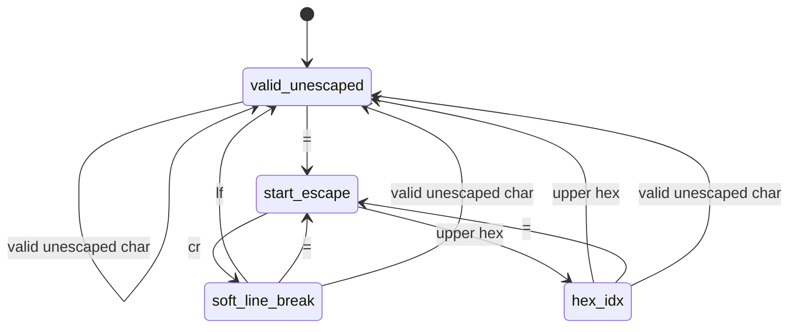

```mermaid
stateDiagram-v2
    [*] --> valid_unescaped
    valid_unescaped --> valid_unescaped : valid unescaped char
    valid_unescaped --> start_escape : =

    # soft line break
    start_escape --> soft_line_break : cr
    soft_line_break --> valid_unescaped : lf
    soft_line_break --> start_escape : =
    soft_line_break --> valid_unescaped : valid unescaped char

    # hex escaped
    start_escape --> hex_idx : upper hex
    hex_idx --> valid_unescaped : upper hex
    hex_idx --> start_escape : =
    hex_idx --> valid_unescaped : valid unescaped char
```