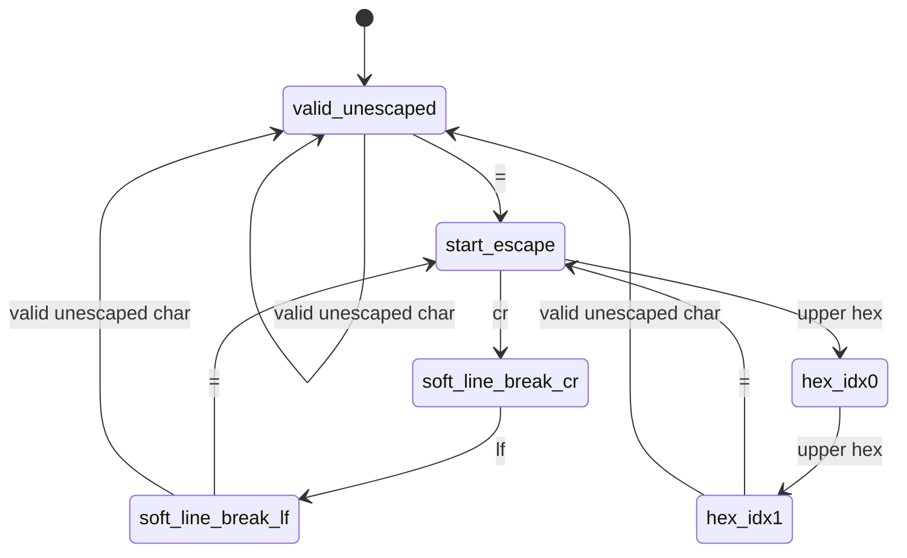

```mermaid
stateDiagram-v2
    [*] --> valid_unescaped
    valid_unescaped --> valid_unescaped : valid unescaped char
    valid_unescaped --> start_escape : =

    # soft line break
    start_escape --> soft_line_break_cr : cr
    soft_line_break_cr --> soft_line_break_lf : lf
    soft_line_break_lf --> start_escape : =
    soft_line_break_lf --> valid_unescaped : valid unescaped char

    
    # hex escaped 
    start_escape --> hex_idx0 : upper hex
    hex_idx0 --> hex_idx1 : upper hex
    hex_idx1 --> start_escape : =
    hex_idx1 --> valid_unescaped : valid unescaped char
```